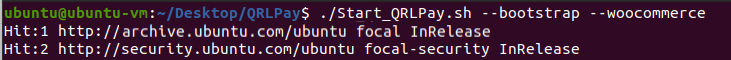

# QRLPay

QRLPay is a simple, easily deployable, lightweight [QRL](https://www.theqrl.org/) payment processor that connects to your own QRL node.

### https://www.youtube.com/watch?v=hqpkXhJJxAA

This project is a PoC developped during the [QRL Hackathon 2022](https://www.theqrl.org/events/qrl-hackathon-2022/).

  

Donation      |  QRL Payment Gateway
:-------------------------:|:-------------------------:
   |   

QRLPay is a self-hosted QRL payment processor, serving two primary use cases:
1. QRL payment gateway, including a WooCommerce plugin that easily turns ANY Wordpress site into a QRL accepting store.
2. Donation button for your website that you can easily embed/link to anywhere.

## Installation
(tests were done with Ubuntu 20.04)

0) Open a terminal and install git

		sudo apt install git

1) Download this project. 

	    git clone https://github.com/0xFF0/QRLPay.git

2) Make the scripts executable.

	    cd QRLPay
	    chmod +x Start_QRLPay.sh Woocommerce_Setup.sh

4) Edit config file (default value will install WooCommerce on your localhost)

		$ gedit env
		
	| Variable    | Description |
	| ----------- | ----------- |
	| QRL_WALLET_API_HOST | Wallet host name (localhost) |
	| QRL_WALLET_API_PORT | Wallet port (5359) |
	| DOMAIN_NAME | Domain where hosted (i.e: shopqrl.tk)  | 
	| MYSQL_PASS  | MySQL password |
	| MYSQL_WORDPRESS_USER | MySQL username for wordpress |
	| MYSQL_WORDPRESS_PASS | MySQL password for wordpress  |
	| WORDPRESS_BLOG_TITLE | Shop name |	
	| WORDPRESS_USER | Shop login username |	
	| WORDPRESS_PASS | Shop password |
	| WORDPRESS_ADMIN_EMAIL | Shop email |
	| QRLPAY_URL | Payment processor URL|

5) Run the script to setup and install everything.

	    ./Start_QRLPay.sh --bootstrap --woocommerce	

	

	  
	

	
4) Navigate to your domain (default is http://127.0.0.1)

## Network diagram

  

## Management

### Containers management

Docker containers can be managed using [Portainer](https://www.portainer.io/). After the setup, navigate to http://127.0.0.1:9000. To manage the containers, click on *Home*, *local* and then on *Containers*.

Portainer can be useful for:

- [Stop and restart containers](https://docs.portainer.io/user/docker/containers/view)
- [View container's logs](https://docs.portainer.io/user/docker/containers/logs) 
- [Access container's console](https://docs.portainer.io/user/docker/containers/console)

### QRL Wallet management

QRLPay use the [walletd-rest-proxy](https://github.com/theQRL/walletd-rest-proxy) to communicate with the wallet. 

[QRL wallet API](https://docs.theqrl.org/developers/walletAPI/) can be used to manage the wallet 

		$ curl -XGET http://127.0.0.1:5359/api/ListAddresses

QRL wallet file is created in *qrlData/Mainnet/walletd.json*. Be careful to not reuse the same testnet wallet in production (i.e: to avoid reusing OTS keys).

## Credits

Code based on https://github.com/xmrsale/xmrSale.

